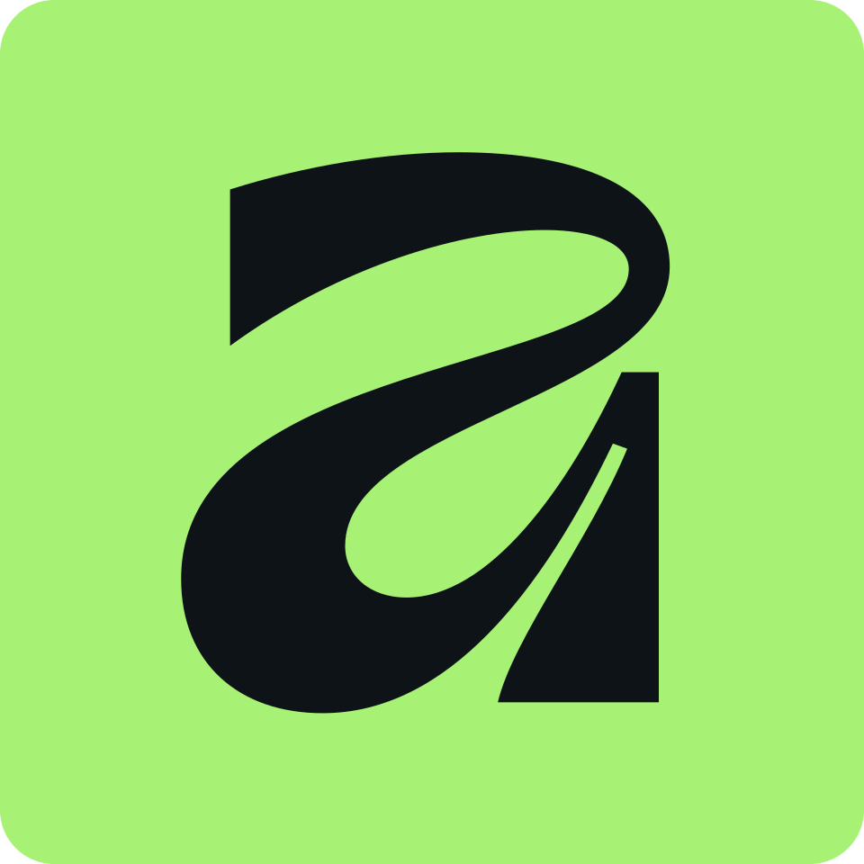
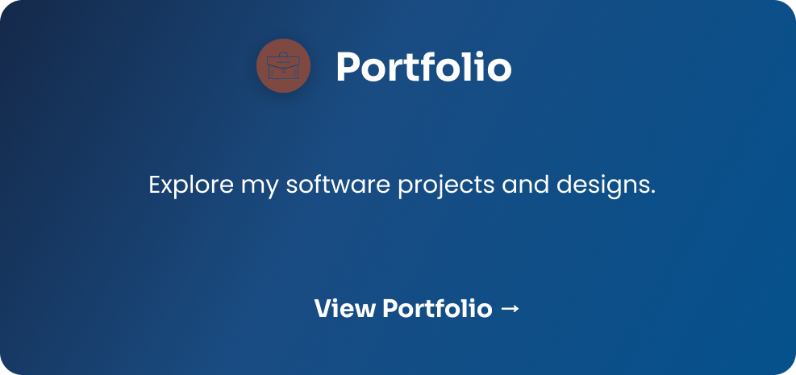
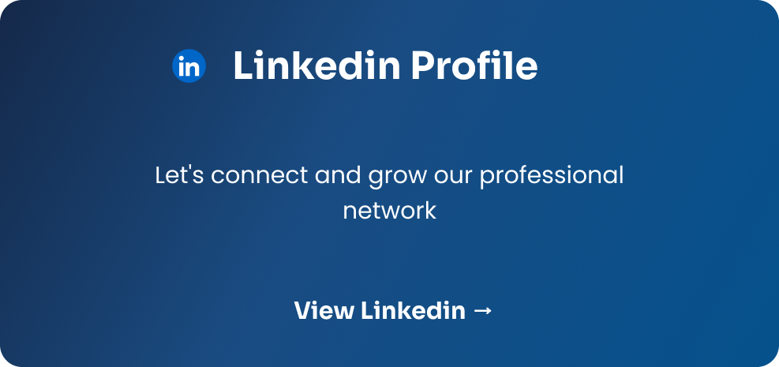

  

---

## 👨‍💻 About Me

I'm a Full Stack Developer and Graphic Designer passionate about building functional software and intuitive digital experiences.

I enjoy combining programming, design, and continuous learning to create projects that make a real impact.

## ​💻​​ Tech Stack

### Languages

  

### Databases

  

### Design

  
  &nbsp;
  
  &nbsp;
  

### Tools

  
  

## ​🔗​ Links

  

  

---

Thanks for visiting my profile! 

